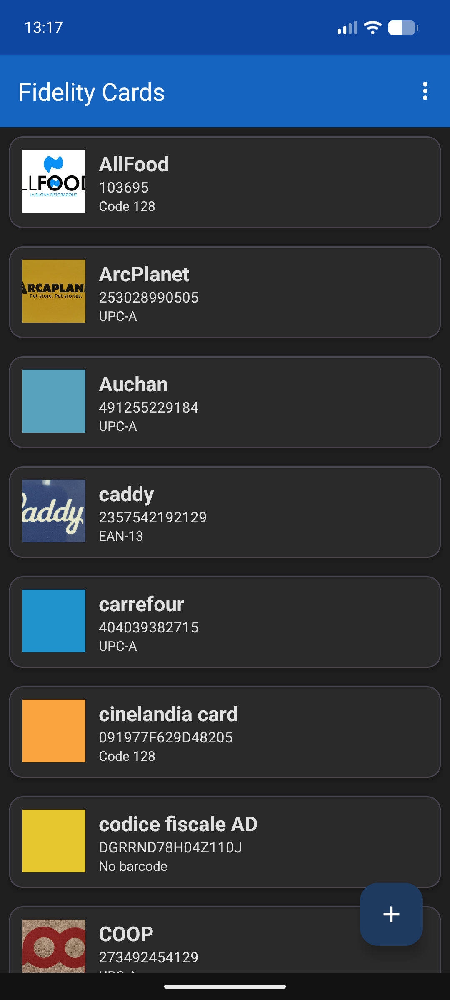

# Fidelity Cards

An Android app in Kotlin for managing your loyalty / fidelity cards: add, edit, delete, and import/export cards from [Catima](https://catima.app) backups.



## Features

- **Add / edit / delete** cards with store name, card ID, barcode type, notes, and optional images (icon, front, back).
- **Barcode display** for all common formats: Code 128, EAN-13, EAN-8, UPC-A, UPC-E, Code 39/93, ITF, QR Code, PDF-417, Data Matrix, Aztec, Codabar (rendered with ZXing).
- **Import from Catima backup** (`.zip`): reads `catima.csv` and its `card_N_front/back/icon.png` images.
- **Export to Catima backup** (`.zip`): produces a `catima.csv` plus images, re-importable in Catima.
- **Light & dark theme** support.

## Screenshots

| Main list | Card detail |
|-----------|-------------|
|  | |

## Requirements

- Android 7.0 (API 24) or newer

## Usage

### Import a Catima backup

1. Tap the **Import** icon in the top bar.
2. Pick your `.zip` backup (e.g. `catima (1).zip` from `Download/`).
3. Cards and their images are added automatically.

### Export to Catima

1. Tap the **Export** icon in the top bar.
2. Choose a destination and name (e.g. `catima_backup.zip`).
3. Optionally include card images.

## Build

```bash
./gradlew :app:assembleDebug
```

The APK is produced at `app/build/outputs/apk/debug/app-debug.apk`.

## Tech

- Kotlin
- Jetpack (AppCompat, RecyclerView, Material Components 3, ViewBinding, Lifecycle, Coroutines)
- [ZXing core](https://github.com/zxing/zxing) for barcode generation
- JSON persistence (`CardStore`)